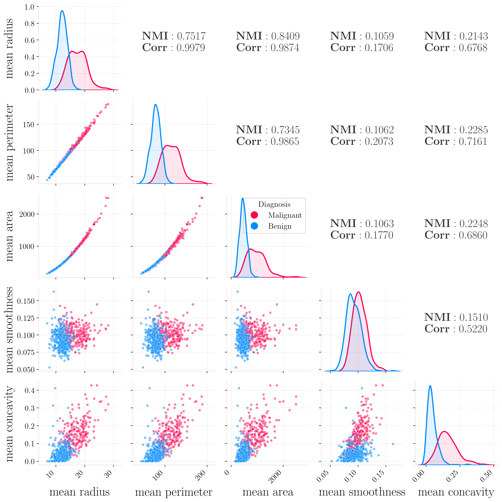
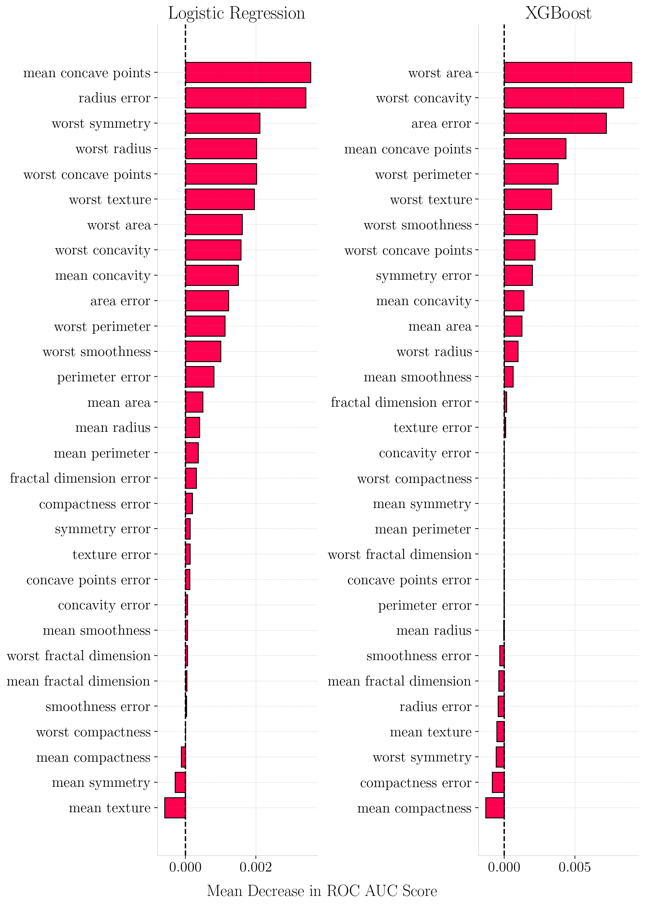
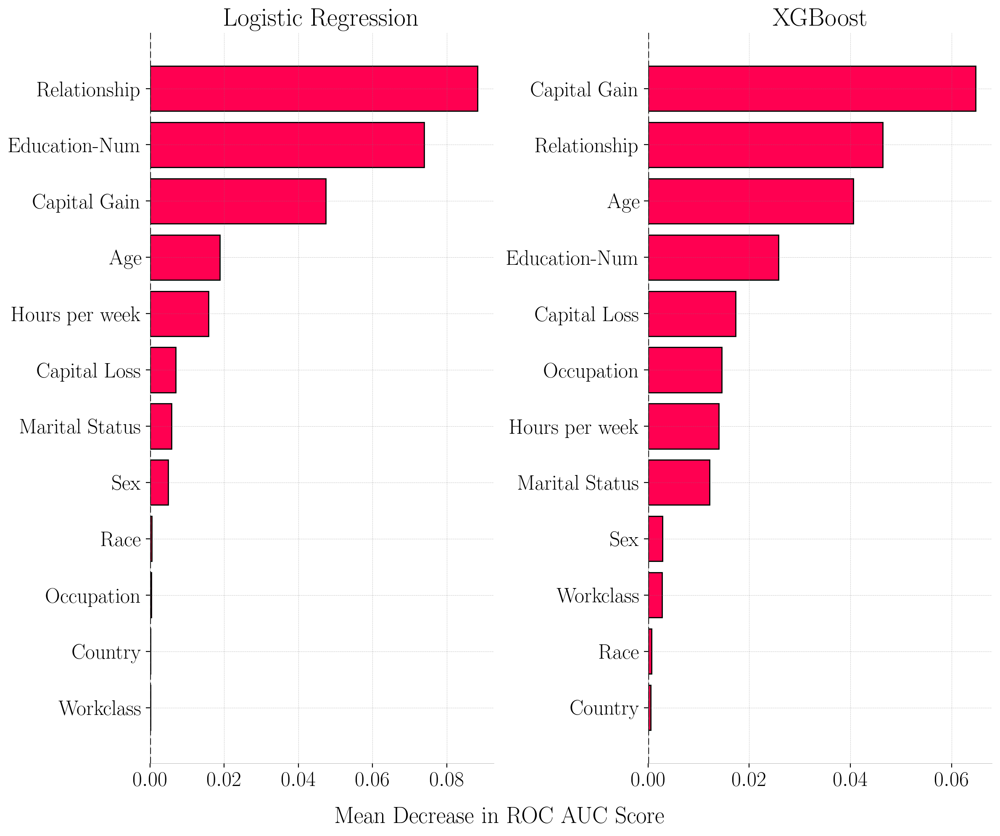
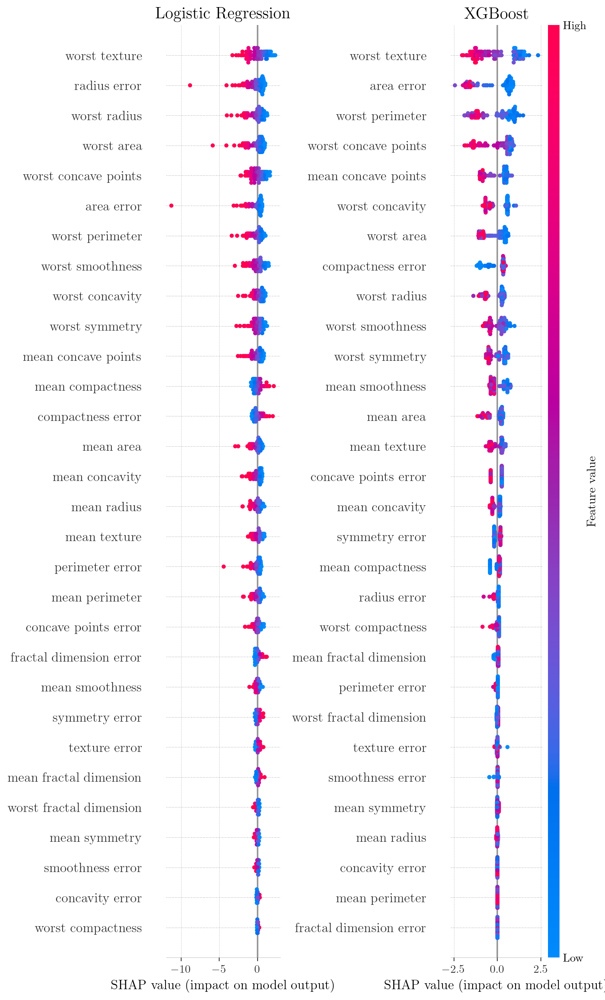
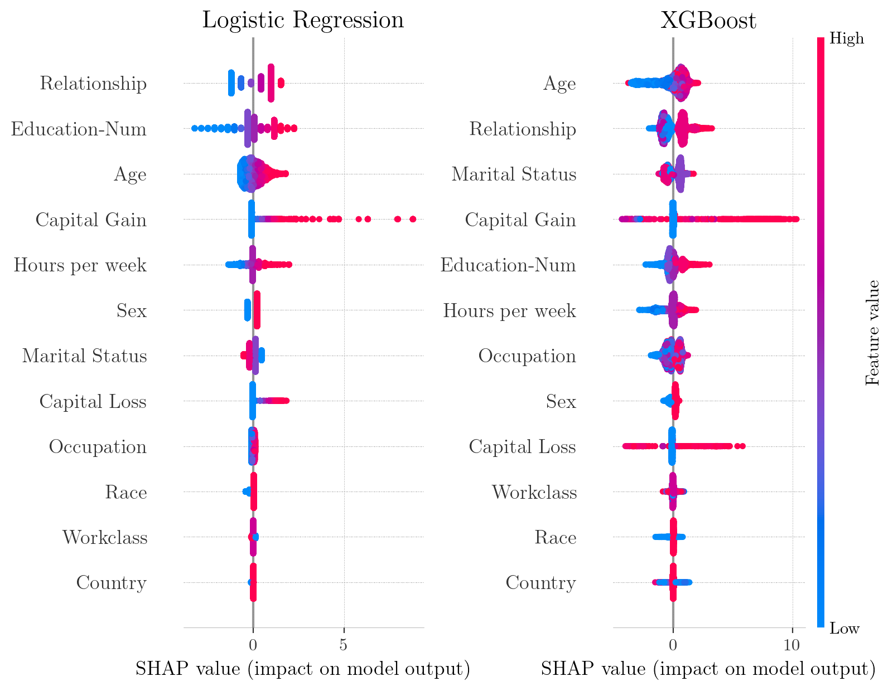
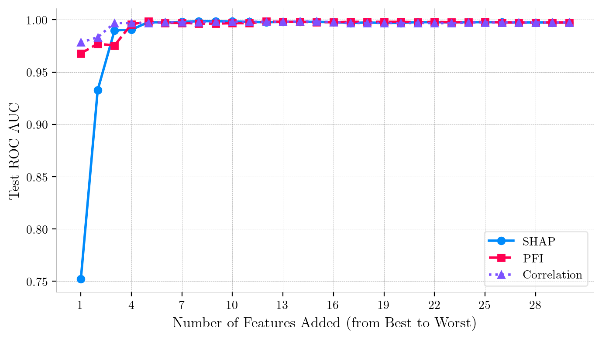
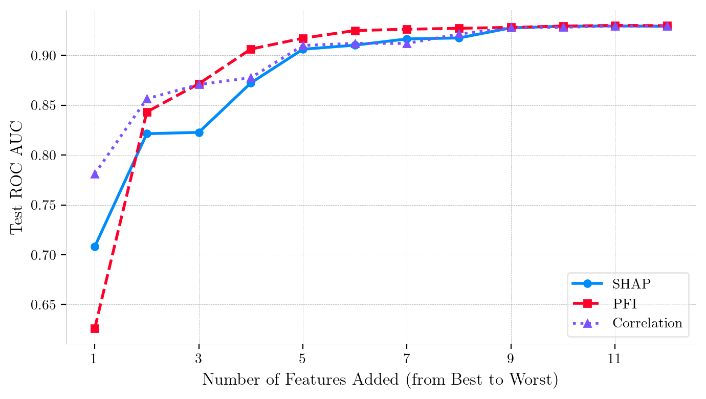
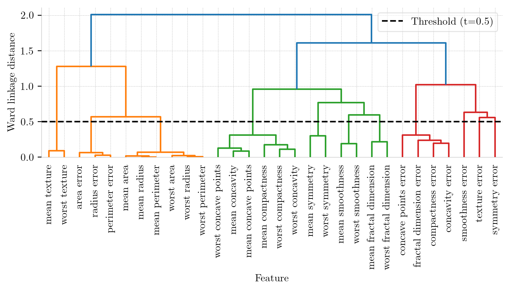
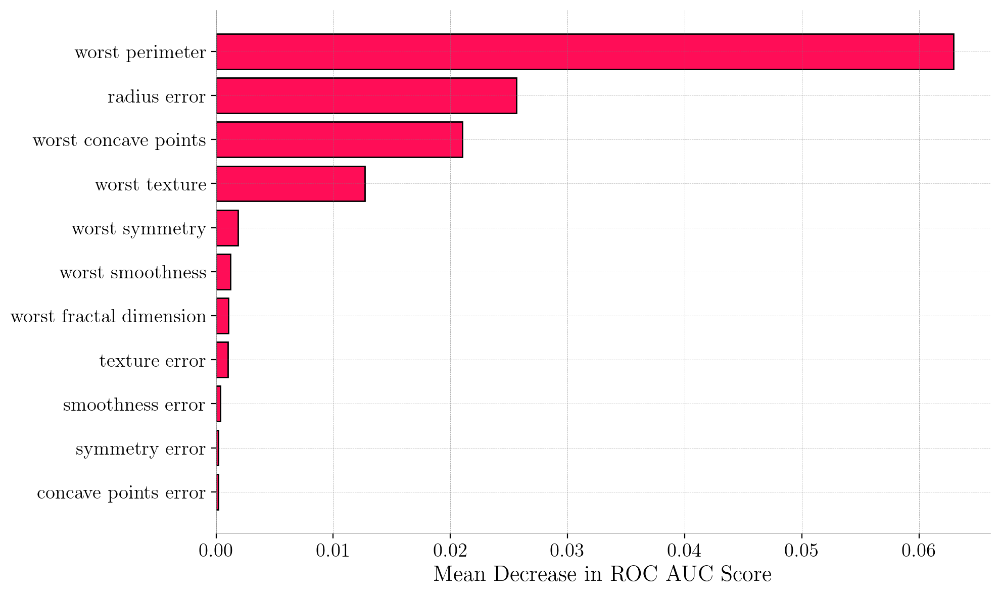
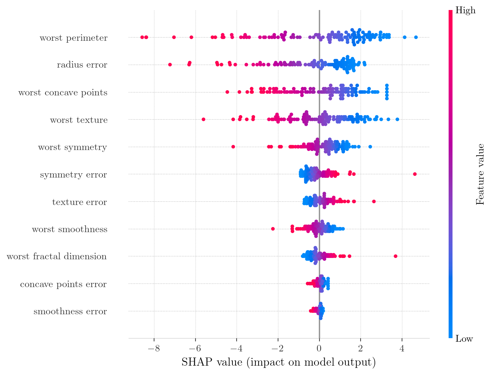

# SHAP Values and Other Indicators of Feature Predictive Power in Binary Classification 

## 📌 Project Overview

This repository contains the implementation, analysis, and experiments from the thesis *SHAP Values and Other Indicators of Feature Predictive Power in Binary Classification*. The primary objective of this project is to conduct a comparative analysis of feature predictive power assessment methods, evaluating the reliability of SHAP (SHapley Additive explanations) values against Permutation Feature Importance (PFI) and standard statistical measures like Pearson Correlation and Normalized Mutual Information (NMI).

The study explores these methods in the context of Logistic Regression and XGBoost models, specifically highlighting how they behave under extreme multicollinearity.

## 🔬 Methodology

### Interpretability Methods Analyzed

* **Pearson Correlation Coefficient**: Serves as the baseline for assessing linear associations between variables.

* **Normalized Mutual Information (NMI)**: An information-theoretic approach designed to detect the magnitude of shared relationships between two random variables, capable of capturing non-linear and non-monotonic dependencies.

* **Permutation Feature Importance (PFI)**: A model-agnostic technique that evaluates importance by measuring the degradation in model performance (measured via ROC AUC) when a feature's values are randomly shuffled.

* **SHAP (SHapley Additive explanations)**: A unified framework rooted in cooperative game theory that distributes a model's prediction payout among its features, satisfying desirable axiomatic properties (Efficiency, Symmetry, Dummy Player, Additivity).

### Datasets

1. **Breast Cancer Wisconsin (Diagnostic) Dataset**: A strictly numerical dataset of 569 samples and 30 features derived from digitized images of cell nuclei. It is characterized by severe multicollinearity (e.g., radius, perimeter, and area are mathematically related).

2. **Adult Census Income Dataset**: Contains 32,561 records with a mix of continuous and categorical features, predicting whether an individual earns more than $50,000 annually.

### Models

* **Logistic Regression**: Implemented as a linear baseline model.

* **XGBoost (Extreme Gradient Boosting)**: Implemented as a complex, non-linear _"black-box"_ tree ensemble.

## 📊 Key Findings and Experiments

### 1. The Impact of Multicollinearity

In the Breast Cancer Wisconsin dataset, strong near-perfect linear relationships were observed, such as between mean radius and mean perimeter ($r=0.9979$).

### 2. Discrepancies Between SHAP and PFI

Experimental results reveal significant inconsistencies between global rankings derived from PFI and SHAP.

* **Substitution Effect**: In highly correlated environments, PFI scores were found to be uniformly low because models could rely on correlated substitute features when one was permuted.

* **Model Architecture Matters**: Logistic Regression distributed its feature importance across a broader set of correlated features (showing a funnel-shaped SHAP decay), while XGBoost performed internal feature selection, assigning near-zero importance to non-informative features.

### 3. Iterative Feature Addition

Iterative selection experiments (Forward and Backward Selection) demonstrated that SHAP does not necessarily prioritize features with the highest standalone predictive power in redundant datasets. When features were added sequentially based on rankings, PFI and Correlation sometimes recovered model performance faster than SHAP in the initial stages.

### 4. Mitigating Multicollinearity via Hierarchical Clustering

To stabilize importance rankings and address the substitution effect, a dimensionality reduction strategy using Hierarchical Clustering (Ward's minimum variance method) was applied to the feature space.

* **Dimensionality Reduction**: The feature space was reduced from 30 variables to 11 representative features.

* **Performance Maintenance**: The reduced Logistic Regression model achieved near-identical predictive power (ROC AUC of 0.9967 vs 0.9974) compared to the full model.

* **Convergence of Interpretability**: The removal of redundancy unmasked the true predictive power of features, causing PFI scores to surge and bringing SHAP and PFI rankings into alignment.

| Metric | Full Model (30 Features) | Reduced Model (11 Features, t=0.5) | 
| :--- | :--- | :--- |
| Precision | 0.98 | 0.98 | 
| Recall | 0.95 | 0.95 | 
| F1-Score | 0.96 | 0.96 | 
| Accuracy | 0.97 | 0.97 | 
| ROC AUC | 0.9974 | 0.9967 |

## 💡 Conclusions

* **Linear vs. Non-linear Dependencies**: Pearson Correlation is an effective baseline for linear dependencies, but NMI is required for categorical or non-linear relationships (like those in the Adult dataset).

* **Ranking Inconsistencies**: Multicollinearity heavily obscures feature importance. PFI tends to underestimate importance due to the substitution effect, while SHAP distributes credit among correlated variables.

* **Clustering Enhances Reliability**: Grouping highly correlated features prior to model training significantly enhances the stability and clinical reliability of feature importance assessments
